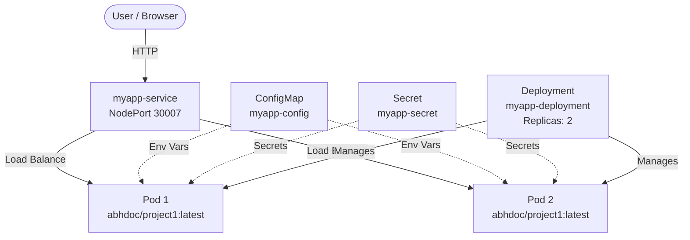

# ☸️ Project 2 — Kubernetes Deployment of a Node.js App

https://github.com/gitbsns/k8s-deployment/blob/main/screenshots/cloudflaredash.png
https://github.com/gitbsns/k8s-deployment/blob/main/screenshots/k8sscaled.png
https://github.com/gitbsns/k8s-deployment/blob/main/screenshots/kube.png
https://github.com/gitbsns/k8s-deployment/blob/main/screenshots/kubeapp.png
https://github.com/gitbsns/k8s-deployment/blob/main/screenshots/kubedeployment.png
https://github.com/gitbsns/k8s-deployment/blob/main/screenshots/kubepod.png
https://github.com/gitbsns/k8s-deployment/blob/main/screenshots/kubeurl.png

> Deploying the containerized Node.js app from **Project 1** onto a Kubernetes cluster using declarative YAML manifests.

---

## 📑 Table of Contents

- [Project Overview](#-project-overview)
- [Architecture](#️-architecture)
- [Tech Stack](#️-tech-stack)
- [Project Structure](#-project-structure)
- [Deployment Steps](#-deployment-steps)
- [Key Kubernetes Concepts](#-key-kubernetes-concepts-demonstrated)
- [Testing Self-Healing & Scaling](#-testing-self-healing--scaling)
- [Rolling Updates](#-rolling-updates)
- [Troubleshooting](#-troubleshooting)
- [Cleanup](#-cleanup)

---

## 📌 Project Overview

This project takes the containerized Node.js application from **Project 1** and deploys it to a Kubernetes cluster. It demonstrates core Kubernetes concepts including **Deployments, Services, ConfigMaps, Secrets, health probes, resource limits, and self-healing**.

### ✅ What this project proves

- Declarative infrastructure with YAML manifests
- Multi-replica deployments with load balancing
- Configuration & secret management
- Health checks for reliability
- Self-healing and rolling updates

---

## 🏗️ Architecture



### Component Overview

| Component | Name / Type | Purpose |
|-----------|-------------|---------|
| **Deployment** | `myapp-deployment` | Manages 2 replicas of the app |
| **Pods** | 2x `myapp` | Running containers |
| **Service** | `myapp-service` (NodePort) | Exposes app on port `30007` |
| **ConfigMap** | `myapp-config` | Non-sensitive environment variables |
| **Secret** | `myapp-secret` | Sensitive data (base64 encoded) |

---

## 🛠️ Tech Stack

| Category | Tools |
|----------|-------|
| Orchestration | Kubernetes (Minikube) |
| CLI | kubectl |
| Container Runtime | Docker |
| Configuration | YAML |
| Application | Node.js / Express |
| Image Registry | Docker Hub |

---

## 📁 Project Structure

```text
project2/
├── k8s-manifests/
│   ├── configmap.yaml      # Environment variables
│   ├── secret.yaml         # Sensitive data (base64)
│   ├── deployment.yaml     # Pods + ReplicaSet (2 replicas)
│   └── service.yaml        # NodePort service
└── README.md
```

---

## 🚀 Deployment Steps

### Prerequisites

- [Minikube](https://minikube.sigs.k8s.io/docs/start/) installed
- [kubectl](https://kubernetes.io/docs/tasks/tools/) configured
- Docker image `abhdoc/project1:latest` available on Docker Hub
- Minimum **2 CPUs** and **2 GB RAM**

### 1️⃣ Start Minikube

```bash
minikube start --driver=docker --cpus=2 --memory=1800
```

### 2️⃣ Apply Manifests

```bash
cd k8s-manifests
kubectl apply -f .
```

**Expected output:**

```text
configmap/myapp-config created
secret/myapp-secret created
deployment.apps/myapp-deployment created
service/myapp-service created
```

### 3️⃣ Verify Deployment

```bash
kubectl get pods
kubectl get svc
kubectl get deployment
kubectl get all
```

### 4️⃣ Access the Application

```bash
minikube service myapp-service --url
```

Open the returned URL in your browser and test these endpoints:

| Endpoint | Purpose |
|----------|---------|
| `/` | App greeting |
| `/info` | ConfigMap / Secret verification |
| `/health` | Health check |

---

## 🎯 Key Kubernetes Concepts Demonstrated

| Concept | Where Used |
|---------|-----------|
| **Deployment** | 2 replicas of the app |
| **Service (NodePort)** | Exposing app on port `30007` |
| **ConfigMap** | `APP_ENV`, `APP_NAME`, `LOG_LEVEL` |
| **Secret** | `SESSION_SECRET` (base64) |
| **Liveness Probe** | Auto-restart unhealthy pods |
| **Readiness Probe** | No traffic until pod is ready |
| **Resource Limits** | CPU/RAM requests and limits |
| **Labels & Selectors** | Service → Pod discovery |
| **ReplicaSet** | Ensures desired pod count |

---

## 🔁 Testing Self-Healing & Scaling

**Self-healing** — delete a pod and watch Kubernetes recreate it automatically:

```bash
kubectl get pods
kubectl delete pod <pod-name>
kubectl get pods -w
```

**Scaling** — change the number of replicas on the fly:

```bash
kubectl scale deployment myapp-deployment --replicas=4
kubectl get pods
```

---

## 🔄 Rolling Updates

```bash
# Update the image to a new version
kubectl set image deployment/myapp-deployment <container-name>=abhdoc/project1:v2

# Watch the rollout
kubectl rollout status deployment/myapp-deployment

# Roll back if something goes wrong
kubectl rollout undo deployment/myapp-deployment
```

---

## 🧰 Troubleshooting

| Problem | Command |
|---------|---------|
| Pod not starting | `kubectl describe pod <pod-name>` |
| Check app logs | `kubectl logs <pod-name>` |
| `ImagePullBackOff` | Verify the image name/tag exists on Docker Hub |
| Probe failing | Check `/health` responds with `200` |
| Can't reach service | `minikube service myapp-service --url` |

---

## 🧹 Cleanup

```bash
kubectl delete -f k8s-manifests/
minikube stop
```

---

## 👤 Author

**abhdoc** — [GitHub](https://github.com/abhdoc)

⭐ If you found this useful, consider giving the repo a star!
